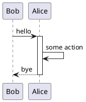
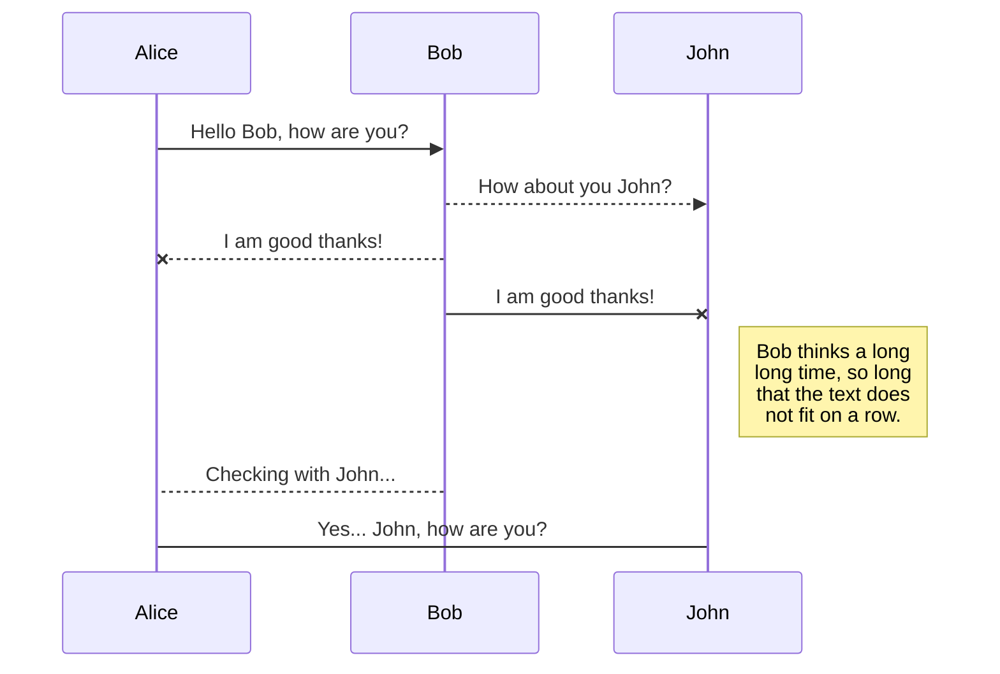

supportedFileTypes:  [
  'txt',    'ts',         'js',
  're',     'scss',       'rust',
  'java',   'cpp',        'c',
  'html',   'xml',        'md',
  'yaml',   'json',       'json5',
  'py',     'bash',       'sh',
  'go',     'objectivec', 'php',
  'cs',     'swift',      'rb',
  'kotlin', 'scala',      'cr',
  'puml',   'mermaid',    'cmake',
  'proto',  'sql',        'hs',
  'ino'
]
REGEX::: /\/\/\s?(\S*?$)/
REGEX:::MATCH [
  '// snippets/sample.txt',
  'snippets/sample.txt',
  index: 0,
  input: '// snippets/sample.txt',
  groups: undefined
]
symbol,match// // snippets/sample.txt,snippets/sample.txt
supportedFileTypes:  [
  'txt',    'ts',         'js',
  're',     'scss',       'rust',
  'java',   'cpp',        'c',
  'html',   'xml',        'md',
  'yaml',   'json',       'json5',
  'py',     'bash',       'sh',
  'go',     'objectivec', 'php',
  'cs',     'swift',      'rb',
  'kotlin', 'scala',      'cr',
  'puml',   'mermaid',    'cmake',
  'proto',  'sql',        'hs',
  'ino'
]
REGEX::: /\/\/\s?(\S*?$)/
REGEX:::MATCH [
  '// snippets/sample.re',
  'snippets/sample.re',
  index: 0,
  input: '// snippets/sample.re',
  groups: undefined
]
symbol,match// // snippets/sample.re,snippets/sample.re
supportedFileTypes:  [
  'txt',    'ts',         'js',
  're',     'scss',       'rust',
  'java',   'cpp',        'c',
  'html',   'xml',        'md',
  'yaml',   'json',       'json5',
  'py',     'bash',       'sh',
  'go',     'objectivec', 'php',
  'cs',     'swift',      'rb',
  'kotlin', 'scala',      'cr',
  'puml',   'mermaid',    'cmake',
  'proto',  'sql',        'hs',
  'ino'
]
REGEX::: /\/\/\s?(\S*?$)/
REGEX:::MATCH [
  '// snippets/sample.ts',
  'snippets/sample.ts',
  index: 0,
  input: '// snippets/sample.ts',
  groups: undefined
]
symbol,match// // snippets/sample.ts,snippets/sample.ts
supportedFileTypes:  [
  'txt',    'ts',         'js',
  're',     'scss',       'rust',
  'java',   'cpp',        'c',
  'html',   'xml',        'md',
  'yaml',   'json',       'json5',
  'py',     'bash',       'sh',
  'go',     'objectivec', 'php',
  'cs',     'swift',      'rb',
  'kotlin', 'scala',      'cr',
  'puml',   'mermaid',    'cmake',
  'proto',  'sql',        'hs',
  'ino'
]
REGEX::: /\/\/\s?(\S*?$)/
REGEX:::MATCH [
  '// snippets/sample.js',
  'snippets/sample.js',
  index: 0,
  input: '// snippets/sample.js',
  groups: undefined
]
symbol,match// // snippets/sample.js,snippets/sample.js
supportedFileTypes:  [
  'txt',    'ts',         'js',
  're',     'scss',       'rust',
  'java',   'cpp',        'c',
  'html',   'xml',        'md',
  'yaml',   'json',       'json5',
  'py',     'bash',       'sh',
  'go',     'objectivec', 'php',
  'cs',     'swift',      'rb',
  'kotlin', 'scala',      'cr',
  'puml',   'mermaid',    'cmake',
  'proto',  'sql',        'hs',
  'ino'
]
supportedFileTypes:  [
  'txt',    'ts',         'js',
  're',     'scss',       'rust',
  'java',   'cpp',        'c',
  'html',   'xml',        'md',
  'yaml',   'json',       'json5',
  'py',     'bash',       'sh',
  'go',     'objectivec', 'php',
  'cs',     'swift',      'rb',
  'kotlin', 'scala',      'cr',
  'puml',   'mermaid',    'cmake',
  'proto',  'sql',        'hs',
  'ino'
]
REGEX::: /#\s?(\S*?$)/
REGEX:::MATCH [
  '# snippets/sample.py',
  'snippets/sample.py',
  index: 0,
  input: '# snippets/sample.py',
  groups: undefined
]
symbol,match# # snippets/sample.py,snippets/sample.py
supportedFileTypes:  [
  'txt',    'ts',         'js',
  're',     'scss',       'rust',
  'java',   'cpp',        'c',
  'html',   'xml',        'md',
  'yaml',   'json',       'json5',
  'py',     'bash',       'sh',
  'go',     'objectivec', 'php',
  'cs',     'swift',      'rb',
  'kotlin', 'scala',      'cr',
  'puml',   'mermaid',    'cmake',
  'proto',  'sql',        'hs',
  'ino'
]
REGEX::: /\/\/\s?(\S*?$)/
REGEX:::MATCH [
  '// snippets/sample.rs',
  'snippets/sample.rs',
  index: 0,
  input: '// snippets/sample.rs',
  groups: undefined
]
symbol,match// // snippets/sample.rs,snippets/sample.rs
supportedFileTypes:  [
  'txt',    'ts',         'js',
  're',     'scss',       'rust',
  'java',   'cpp',        'c',
  'html',   'xml',        'md',
  'yaml',   'json',       'json5',
  'py',     'bash',       'sh',
  'go',     'objectivec', 'php',
  'cs',     'swift',      'rb',
  'kotlin', 'scala',      'cr',
  'puml',   'mermaid',    'cmake',
  'proto',  'sql',        'hs',
  'ino'
]
REGEX::: /\/\/\s?(\S*?$)/
REGEX:::MATCH [
  '// snippets/sample.cpp',
  'snippets/sample.cpp',
  index: 0,
  input: '// snippets/sample.cpp',
  groups: undefined
]
symbol,match// // snippets/sample.cpp,snippets/sample.cpp
supportedFileTypes:  [
  'txt',    'ts',         'js',
  're',     'scss',       'rust',
  'java',   'cpp',        'c',
  'html',   'xml',        'md',
  'yaml',   'json',       'json5',
  'py',     'bash',       'sh',
  'go',     'objectivec', 'php',
  'cs',     'swift',      'rb',
  'kotlin', 'scala',      'cr',
  'puml',   'mermaid',    'cmake',
  'proto',  'sql',        'hs',
  'ino'
]
REGEX::: /\/\/\s?(\S*?$)/
REGEX:::MATCH [
  '// snippets/sample.ino',
  'snippets/sample.ino',
  index: 0,
  input: '// snippets/sample.ino',
  groups: undefined
]
symbol,match// // snippets/sample.ino,snippets/sample.ino
supportedFileTypes:  [
  'txt',    'ts',         'js',
  're',     'scss',       'rust',
  'java',   'cpp',        'c',
  'html',   'xml',        'md',
  'yaml',   'json',       'json5',
  'py',     'bash',       'sh',
  'go',     'objectivec', 'php',
  'cs',     'swift',      'rb',
  'kotlin', 'scala',      'cr',
  'puml',   'mermaid',    'cmake',
  'proto',  'sql',        'hs',
  'ino'
]
REGEX::: /\/\/\s?(\S*?$)/
REGEX:::MATCH [
  '// snippets/sample.c',
  'snippets/sample.c',
  index: 0,
  input: '// snippets/sample.c',
  groups: undefined
]
symbol,match// // snippets/sample.c,snippets/sample.c
supportedFileTypes:  [
  'txt',    'ts',         'js',
  're',     'scss',       'rust',
  'java',   'cpp',        'c',
  'html',   'xml',        'md',
  'yaml',   'json',       'json5',
  'py',     'bash',       'sh',
  'go',     'objectivec', 'php',
  'cs',     'swift',      'rb',
  'kotlin', 'scala',      'cr',
  'puml',   'mermaid',    'cmake',
  'proto',  'sql',        'hs',
  'ino'
]
REGEX::: /\/\/\s?(\S*?$)/
REGEX:::MATCH [
  '// snippets/sample.java',
  'snippets/sample.java',
  index: 0,
  input: '// snippets/sample.java',
  groups: undefined
]
symbol,match// // snippets/sample.java,snippets/sample.java
supportedFileTypes:  [
  'txt',    'ts',         'js',
  're',     'scss',       'rust',
  'java',   'cpp',        'c',
  'html',   'xml',        'md',
  'yaml',   'json',       'json5',
  'py',     'bash',       'sh',
  'go',     'objectivec', 'php',
  'cs',     'swift',      'rb',
  'kotlin', 'scala',      'cr',
  'puml',   'mermaid',    'cmake',
  'proto',  'sql',        'hs',
  'ino'
]
REGEX::: /\/\/\s?(\S*?$)/
REGEX:::MATCH [
  '// snippets/sample.go',
  'snippets/sample.go',
  index: 0,
  input: '// snippets/sample.go',
  groups: undefined
]
symbol,match// // snippets/sample.go,snippets/sample.go
supportedFileTypes:  [
  'txt',    'ts',         'js',
  're',     'scss',       'rust',
  'java',   'cpp',        'c',
  'html',   'xml',        'md',
  'yaml',   'json',       'json5',
  'py',     'bash',       'sh',
  'go',     'objectivec', 'php',
  'cs',     'swift',      'rb',
  'kotlin', 'scala',      'cr',
  'puml',   'mermaid',    'cmake',
  'proto',  'sql',        'hs',
  'ino'
]
REGEX::: /#\s?(\S*?$)/
REGEX:::MATCH [
  '# snippets/sample.sh',
  'snippets/sample.sh',
  index: 0,
  input: '# snippets/sample.sh',
  groups: undefined
]
symbol,match# # snippets/sample.sh,snippets/sample.sh
supportedFileTypes:  [
  'txt',    'ts',         'js',
  're',     'scss',       'rust',
  'java',   'cpp',        'c',
  'html',   'xml',        'md',
  'yaml',   'json',       'json5',
  'py',     'bash',       'sh',
  'go',     'objectivec', 'php',
  'cs',     'swift',      'rb',
  'kotlin', 'scala',      'cr',
  'puml',   'mermaid',    'cmake',
  'proto',  'sql',        'hs',
  'ino'
]
REGEX::: /#\s?(\S*?$)/
REGEX:::MATCH [
  '# snippets/sample.sh',
  'snippets/sample.sh',
  index: 0,
  input: '# snippets/sample.sh',
  groups: undefined
]
symbol,match# # snippets/sample.sh,snippets/sample.sh
supportedFileTypes:  [
  'txt',    'ts',         'js',
  're',     'scss',       'rust',
  'java',   'cpp',        'c',
  'html',   'xml',        'md',
  'yaml',   'json',       'json5',
  'py',     'bash',       'sh',
  'go',     'objectivec', 'php',
  'cs',     'swift',      'rb',
  'kotlin', 'scala',      'cr',
  'puml',   'mermaid',    'cmake',
  'proto',  'sql',        'hs',
  'ino'
]
REGEX::: /\/\/\s?(\S*?$)/
REGEX:::MATCH [
  '// snippets/sample.m',
  'snippets/sample.m',
  index: 0,
  input: '// snippets/sample.m',
  groups: undefined
]
symbol,match// // snippets/sample.m,snippets/sample.m
supportedFileTypes:  [
  'txt',    'ts',         'js',
  're',     'scss',       'rust',
  'java',   'cpp',        'c',
  'html',   'xml',        'md',
  'yaml',   'json',       'json5',
  'py',     'bash',       'sh',
  'go',     'objectivec', 'php',
  'cs',     'swift',      'rb',
  'kotlin', 'scala',      'cr',
  'puml',   'mermaid',    'cmake',
  'proto',  'sql',        'hs',
  'ino'
]
REGEX::: /\/\/\s?(\S*?$)/
REGEX:::MATCH [
  '// snippets/sample.scss',
  'snippets/sample.scss',
  index: 0,
  input: '// snippets/sample.scss',
  groups: undefined
]
symbol,match// // snippets/sample.scss,snippets/sample.scss
supportedFileTypes:  [
  'txt',    'ts',         'js',
  're',     'scss',       'rust',
  'java',   'cpp',        'c',
  'html',   'xml',        'md',
  'yaml',   'json',       'json5',
  'py',     'bash',       'sh',
  'go',     'objectivec', 'php',
  'cs',     'swift',      'rb',
  'kotlin', 'scala',      'cr',
  'puml',   'mermaid',    'cmake',
  'proto',  'sql',        'hs',
  'ino'
]
REGEX::: /\/\/\s?(\S*?$)/
REGEX:::MATCH [
  '// snippets/sample.php',
  'snippets/sample.php',
  index: 0,
  input: '// snippets/sample.php',
  groups: undefined
]
symbol,match// // snippets/sample.php,snippets/sample.php
supportedFileTypes:  [
  'txt',    'ts',         'js',
  're',     'scss',       'rust',
  'java',   'cpp',        'c',
  'html',   'xml',        'md',
  'yaml',   'json',       'json5',
  'py',     'bash',       'sh',
  'go',     'objectivec', 'php',
  'cs',     'swift',      'rb',
  'kotlin', 'scala',      'cr',
  'puml',   'mermaid',    'cmake',
  'proto',  'sql',        'hs',
  'ino'
]
REGEX::: /\/\/\s?(\S*?$)/
REGEX:::MATCH [
  '// snippets/sample.cs',
  'snippets/sample.cs',
  index: 0,
  input: '// snippets/sample.cs',
  groups: undefined
]
symbol,match// // snippets/sample.cs,snippets/sample.cs
supportedFileTypes:  [
  'txt',    'ts',         'js',
  're',     'scss',       'rust',
  'java',   'cpp',        'c',
  'html',   'xml',        'md',
  'yaml',   'json',       'json5',
  'py',     'bash',       'sh',
  'go',     'objectivec', 'php',
  'cs',     'swift',      'rb',
  'kotlin', 'scala',      'cr',
  'puml',   'mermaid',    'cmake',
  'proto',  'sql',        'hs',
  'ino'
]
REGEX::: /\/\/\s?(\S*?$)/
REGEX:::MATCH [
  '// snippets/sample.swift',
  'snippets/sample.swift',
  index: 0,
  input: '// snippets/sample.swift',
  groups: undefined
]
symbol,match// // snippets/sample.swift,snippets/sample.swift
supportedFileTypes:  [
  'txt',    'ts',         'js',
  're',     'scss',       'rust',
  'java',   'cpp',        'c',
  'html',   'xml',        'md',
  'yaml',   'json',       'json5',
  'py',     'bash',       'sh',
  'go',     'objectivec', 'php',
  'cs',     'swift',      'rb',
  'kotlin', 'scala',      'cr',
  'puml',   'mermaid',    'cmake',
  'proto',  'sql',        'hs',
  'ino'
]
supportedFileTypes:  [
  'txt',    'ts',         'js',
  're',     'scss',       'rust',
  'java',   'cpp',        'c',
  'html',   'xml',        'md',
  'yaml',   'json',       'json5',
  'py',     'bash',       'sh',
  'go',     'objectivec', 'php',
  'cs',     'swift',      'rb',
  'kotlin', 'scala',      'cr',
  'puml',   'mermaid',    'cmake',
  'proto',  'sql',        'hs',
  'ino'
]
REGEX::: /#\s?(\S*?$)/
REGEX:::MATCH [
  '# snippets/sample.yaml',
  'snippets/sample.yaml',
  index: 0,
  input: '# snippets/sample.yaml',
  groups: undefined
]
symbol,match# # snippets/sample.yaml,snippets/sample.yaml
supportedFileTypes:  [
  'txt',    'ts',         'js',
  're',     'scss',       'rust',
  'java',   'cpp',        'c',
  'html',   'xml',        'md',
  'yaml',   'json',       'json5',
  'py',     'bash',       'sh',
  'go',     'objectivec', 'php',
  'cs',     'swift',      'rb',
  'kotlin', 'scala',      'cr',
  'puml',   'mermaid',    'cmake',
  'proto',  'sql',        'hs',
  'ino'
]
REGEX::: /\/\/\s?(\S*?$)/
REGEX:::MATCH [
  '// snippets/sample.json5',
  'snippets/sample.json5',
  index: 0,
  input: '// snippets/sample.json5',
  groups: undefined
]
symbol,match// // snippets/sample.json5,snippets/sample.json5
supportedFileTypes:  [
  'txt',    'ts',         'js',
  're',     'scss',       'rust',
  'java',   'cpp',        'c',
  'html',   'xml',        'md',
  'yaml',   'json',       'json5',
  'py',     'bash',       'sh',
  'go',     'objectivec', 'php',
  'cs',     'swift',      'rb',
  'kotlin', 'scala',      'cr',
  'puml',   'mermaid',    'cmake',
  'proto',  'sql',        'hs',
  'ino'
]
REGEX::: /#\s?(\S*?$)/
REGEX:::MATCH [
  '# snippets/sample.rb',
  'snippets/sample.rb',
  index: 0,
  input: '# snippets/sample.rb',
  groups: undefined
]
symbol,match# # snippets/sample.rb,snippets/sample.rb
supportedFileTypes:  [
  'txt',    'ts',         'js',
  're',     'scss',       'rust',
  'java',   'cpp',        'c',
  'html',   'xml',        'md',
  'yaml',   'json',       'json5',
  'py',     'bash',       'sh',
  'go',     'objectivec', 'php',
  'cs',     'swift',      'rb',
  'kotlin', 'scala',      'cr',
  'puml',   'mermaid',    'cmake',
  'proto',  'sql',        'hs',
  'ino'
]
REGEX::: /#\s?(\S*?$)/
REGEX:::MATCH [
  '# snippets/sample.cr',
  'snippets/sample.cr',
  index: 0,
  input: '# snippets/sample.cr',
  groups: undefined
]
symbol,match# # snippets/sample.cr,snippets/sample.cr
supportedFileTypes:  [
  'txt',    'ts',         'js',
  're',     'scss',       'rust',
  'java',   'cpp',        'c',
  'html',   'xml',        'md',
  'yaml',   'json',       'json5',
  'py',     'bash',       'sh',
  'go',     'objectivec', 'php',
  'cs',     'swift',      'rb',
  'kotlin', 'scala',      'cr',
  'puml',   'mermaid',    'cmake',
  'proto',  'sql',        'hs',
  'ino'
]
REGEX::: /\/\/\s?(\S*?$)/
REGEX:::MATCH [
  '// snippets/sample.kt',
  'snippets/sample.kt',
  index: 0,
  input: '// snippets/sample.kt',
  groups: undefined
]
symbol,match// // snippets/sample.kt,snippets/sample.kt
supportedFileTypes:  [
  'txt',    'ts',         'js',
  're',     'scss',       'rust',
  'java',   'cpp',        'c',
  'html',   'xml',        'md',
  'yaml',   'json',       'json5',
  'py',     'bash',       'sh',
  'go',     'objectivec', 'php',
  'cs',     'swift',      'rb',
  'kotlin', 'scala',      'cr',
  'puml',   'mermaid',    'cmake',
  'proto',  'sql',        'hs',
  'ino'
]
REGEX::: /\/\/\s?(\S*?$)/
REGEX:::MATCH [
  '// snippets/sample.scala',
  'snippets/sample.scala',
  index: 0,
  input: '// snippets/sample.scala',
  groups: undefined
]
symbol,match// // snippets/sample.scala,snippets/sample.scala
supportedFileTypes:  [
  'txt',    'ts',         'js',
  're',     'scss',       'rust',
  'java',   'cpp',        'c',
  'html',   'xml',        'md',
  'yaml',   'json',       'json5',
  'py',     'bash',       'sh',
  'go',     'objectivec', 'php',
  'cs',     'swift',      'rb',
  'kotlin', 'scala',      'cr',
  'puml',   'mermaid',    'cmake',
  'proto',  'sql',        'hs',
  'ino'
]
REGEX::: /'\s?(\S*?$)/
REGEX:::MATCH [
  "' snippets/sample.puml",
  'snippets/sample.puml',
  index: 0,
  input: "' snippets/sample.puml",
  groups: undefined
]
symbol,match' ' snippets/sample.puml,snippets/sample.puml
supportedFileTypes:  [
  'txt',    'ts',         'js',
  're',     'scss',       'rust',
  'java',   'cpp',        'c',
  'html',   'xml',        'md',
  'yaml',   'json',       'json5',
  'py',     'bash',       'sh',
  'go',     'objectivec', 'php',
  'cs',     'swift',      'rb',
  'kotlin', 'scala',      'cr',
  'puml',   'mermaid',    'cmake',
  'proto',  'sql',        'hs',
  'ino'
]
REGEX::: /%%\s?(\S*?$)/
REGEX:::MATCH [
  '%% snippets/sample.mermaid',
  'snippets/sample.mermaid',
  index: 0,
  input: '%% snippets/sample.mermaid',
  groups: undefined
]
symbol,match%% %% snippets/sample.mermaid,snippets/sample.mermaid
supportedFileTypes:  [
  'txt',    'ts',         'js',
  're',     'scss',       'rust',
  'java',   'cpp',        'c',
  'html',   'xml',        'md',
  'yaml',   'json',       'json5',
  'py',     'bash',       'sh',
  'go',     'objectivec', 'php',
  'cs',     'swift',      'rb',
  'kotlin', 'scala',      'cr',
  'puml',   'mermaid',    'cmake',
  'proto',  'sql',        'hs',
  'ino'
]
REGEX::: /\/\/\s?(\S*?$)/
REGEX:::MATCH [
  '// snippets/sample.proto',
  'snippets/sample.proto',
  index: 0,
  input: '// snippets/sample.proto',
  groups: undefined
]
symbol,match// // snippets/sample.proto,snippets/sample.proto
supportedFileTypes:  [
  'txt',    'ts',         'js',
  're',     'scss',       'rust',
  'java',   'cpp',        'c',
  'html',   'xml',        'md',
  'yaml',   'json',       'json5',
  'py',     'bash',       'sh',
  'go',     'objectivec', 'php',
  'cs',     'swift',      'rb',
  'kotlin', 'scala',      'cr',
  'puml',   'mermaid',    'cmake',
  'proto',  'sql',        'hs',
  'ino'
]
REGEX::: /#\s?(\S*?$)/
REGEX:::MATCH [
  '# snippets/sample.cmake',
  'snippets/sample.cmake',
  index: 0,
  input: '# snippets/sample.cmake',
  groups: undefined
]
symbol,match# # snippets/sample.cmake,snippets/sample.cmake
supportedFileTypes:  [
  'txt',    'ts',         'js',
  're',     'scss',       'rust',
  'java',   'cpp',        'c',
  'html',   'xml',        'md',
  'yaml',   'json',       'json5',
  'py',     'bash',       'sh',
  'go',     'objectivec', 'php',
  'cs',     'swift',      'rb',
  'kotlin', 'scala',      'cr',
  'puml',   'mermaid',    'cmake',
  'proto',  'sql',        'hs',
  'ino'
]
REGEX::: /--\s?(\S*?$)/
REGEX:::MATCH [
  '-- snippets/sample.sql',
  'snippets/sample.sql',
  index: 0,
  input: '-- snippets/sample.sql',
  groups: undefined
]
symbol,match-- -- snippets/sample.sql,snippets/sample.sql
supportedFileTypes:  [
  'txt',    'ts',         'js',
  're',     'scss',       'rust',
  'java',   'cpp',        'c',
  'html',   'xml',        'md',
  'yaml',   'json',       'json5',
  'py',     'bash',       'sh',
  'go',     'objectivec', 'php',
  'cs',     'swift',      'rb',
  'kotlin', 'scala',      'cr',
  'puml',   'mermaid',    'cmake',
  'proto',  'sql',        'hs',
  'ino'
]
REGEX::: /--\s?(\S*?$)/
REGEX:::MATCH [
  '-- snippets/sample.hs',
  'snippets/sample.hs',
  index: 0,
  input: '-- snippets/sample.hs',
  groups: undefined
]
symbol,match-- -- snippets/sample.hs,snippets/sample.hs
supportedFileTypes:  [
  'txt',    'ts',         'js',
  're',     'scss',       'rust',
  'java',   'cpp',        'c',
  'html',   'xml',        'md',
  'yaml',   'json',       'json5',
  'py',     'bash',       'sh',
  'go',     'objectivec', 'php',
  'cs',     'swift',      'rb',
  'kotlin', 'scala',      'cr',
  'puml',   'mermaid',    'cmake',
  'proto',  'sql',        'hs',
  'ino'
]
REGEX::: /#\s?(\S*?$)/
REGEX:::MATCH [
  '# snippets/sample',
  'snippets/sample',
  index: 0,
  input: '# snippets/sample',
  groups: undefined
]
symbol,match# # snippets/sample,snippets/sample
supportedFileTypes:  [
  'txt',    'ts',         'js',
  're',     'scss',       'rust',
  'java',   'cpp',        'c',
  'html',   'xml',        'md',
  'yaml',   'json',       'json5',
  'py',     'bash',       'sh',
  'go',     'objectivec', 'php',
  'cs',     'swift',      'rb',
  'kotlin', 'scala',      'cr',
  'puml',   'mermaid',    'cmake',
  'proto',  'sql',        'hs',
  'ino'
]
REGEX::: /\/\/\s?(\S*?$)/
REGEX:::MATCH [
  '// snippets/sample.cs#L6-L13',
  'snippets/sample.cs#L6-L13',
  index: 0,
  input: '// snippets/sample.cs#L6-L13',
  groups: undefined
]
symbol,match// // snippets/sample.cs#L6-L13,snippets/sample.cs#L6-L13
supportedFileTypes:  [
  'txt',    'ts',         'js',
  're',     'scss',       'rust',
  'java',   'cpp',        'c',
  'html',   'xml',        'md',
  'yaml',   'json',       'json5',
  'py',     'bash',       'sh',
  'go',     'objectivec', 'php',
  'cs',     'swift',      'rb',
  'kotlin', 'scala',      'cr',
  'puml',   'mermaid',    'cmake',
  'proto',  'sql',        'hs',
  'ino'
]
REGEX::: /\/\/\s?(\S*?$)/
REGEX:::MATCH [
  '// snippets/sample.ts',
  'snippets/sample.ts',
  index: 4,
  input: '    // snippets/sample.ts',
  groups: undefined
]
symbol,match// // snippets/sample.ts,snippets/sample.ts
supportedFileTypes:  [
  'txt',    'ts',         'js',
  're',     'scss',       'rust',
  'java',   'cpp',        'c',
  'html',   'xml',        'md',
  'yaml',   'json',       'json5',
  'py',     'bash',       'sh',
  'go',     'objectivec', 'php',
  'cs',     'swift',      'rb',
  'kotlin', 'scala',      'cr',
  'puml',   'mermaid',    'cmake',
  'proto',  'sql',        'hs',
  'ino'
]
supportedFileTypes:  [
  'txt',    'ts',         'js',
  're',     'scss',       'rust',
  'java',   'cpp',        'c',
  'html',   'xml',        'md',
  'yaml',   'json',       'json5',
  'py',     'bash',       'sh',
  'go',     'objectivec', 'php',
  'cs',     'swift',      'rb',
  'kotlin', 'scala',      'cr',
  'puml',   'mermaid',    'cmake',
  'proto',  'sql',        'hs',
  'ino'
]
REGEX::: /\/\/\s?(\S*?$)/
REGEX:::MATCH null
symbol,match// null
supportedFileTypes:  [
  'txt',    'ts',         'js',
  're',     'scss',       'rust',
  'java',   'cpp',        'c',
  'html',   'xml',        'md',
  'yaml',   'json',       'json5',
  'py',     'bash',       'sh',
  'go',     'objectivec', 'php',
  'cs',     'swift',      'rb',
  'kotlin', 'scala',      'cr',
  'puml',   'mermaid',    'cmake',
  'proto',  'sql',        'hs',
  'ino'
]
REGEX::: /\/\/\s?(\S*?$)/
REGEX:::MATCH [
  '// also-not-a-file',
  'also-not-a-file',
  index: 0,
  input: '// also-not-a-file',
  groups: undefined
]
symbol,match// // also-not-a-file,also-not-a-file
supportedFileTypes:  [
  'txt',    'ts',         'js',
  're',     'scss',       'rust',
  'java',   'cpp',        'c',
  'html',   'xml',        'md',
  'yaml',   'json',       'json5',
  'py',     'bash',       'sh',
  'go',     'objectivec', 'php',
  'cs',     'swift',      'rb',
  'kotlin', 'scala',      'cr',
  'puml',   'mermaid',    'cmake',
  'proto',  'sql',        'hs',
  'ino'
]
REGEX::: /\/\/\s?(\S*?$)/
REGEX:::MATCH [
  '// this-file-does-not-exist.txt',
  'this-file-does-not-exist.txt',
  index: 0,
  input: '// this-file-does-not-exist.txt',
  groups: undefined
]
symbol,match// // this-file-does-not-exist.txt,this-file-does-not-exist.txt
supportedFileTypes:  [
  'txt',    'ts',         'js',
  're',     'scss',       'rust',
  'java',   'cpp',        'c',
  'html',   'xml',        'md',
  'yaml',   'json',       'json5',
  'py',     'bash',       'sh',
  'go',     'objectivec', 'php',
  'cs',     'swift',      'rb',
  'kotlin', 'scala',      'cr',
  'puml',   'mermaid',    'cmake',
  'proto',  'sql',        'hs',
  'ino'
]
supportedFileTypes:  [
  'txt',    'ts',         'js',
  're',     'scss',       'rust',
  'java',   'cpp',        'c',
  'html',   'xml',        'md',
  'yaml',   'json',       'json5',
  'py',     'bash',       'sh',
  'go',     'objectivec', 'php',
  'cs',     'swift',      'rb',
  'kotlin', 'scala',      'cr',
  'puml',   'mermaid',    'cmake',
  'proto',  'sql',        'hs',
  'ino'
]
supportedFileTypes:  [
  'txt',    'ts',         'js',
  're',     'scss',       'rust',
  'java',   'cpp',        'c',
  'html',   'xml',        'md',
  'yaml',   'json',       'json5',
  'py',     'bash',       'sh',
  'go',     'objectivec', 'php',
  'cs',     'swift',      'rb',
  'kotlin', 'scala',      'cr',
  'puml',   'mermaid',    'cmake',
  'proto',  'sql',        'hs',
  'ino'
]
REGEX::: /\/\/\s?(\S*?$)/
REGEX:::MATCH [
  '// snippets/sample.ts#L1-2',
  'snippets/sample.ts#L1-2',
  index: 0,
  input: '// snippets/sample.ts#L1-2',
  groups: undefined
]
symbol,match// // snippets/sample.ts#L1-2,snippets/sample.ts#L1-2
# File types

Plain Text

```txt
// snippets/sample.txt

This file is unformatted plain text

```

Reason

```re
// snippets/sample.re

Js.log("Hello, world!")

```

Typescript

```ts
// snippets/sample.ts

export function hello(): string {
  return 'Hello World';
}

```

Javascript

```js
// snippets/sample.js

console.log('Hello World');

```

HTML

```html
<!-- snippets/sample.html -->

<h1>Hello world</h1>

```

Python

```py
# snippets/sample.py

print('Hello World')

```

Rust

```rust
// snippets/sample.rs

fn main() {
    println!("Hello World!");
}

```

C++

```cpp
// snippets/sample.cpp

#include <iostream>
using namespace std;

int main()
{
    cout << "Hello, World!";
    return 0;
}

```

Arduino

```cpp
// snippets/sample.ino

#include <iostream>
using namespace std;

int main()
{
    cout << "Hello, World!";
    return 0;
}

```

C

```c
// snippets/sample.c

#include <stdio.h>
int main()
{
   // printf() displays the string inside quotation
   printf("Hello, World!");
   return 0;
}

```

Java

```java
// snippets/sample.java

public class HelloWorld {

    public static void main(String[] args) {
        // Prints "Hello, World" to the terminal window.
        System.out.println("Hello, World");
    }

}

```

Golang

```go
// snippets/sample.go

package main

import "fmt"

func main() {
    fmt.Println("hello world")
}

```

Bash

```sh
# snippets/sample.sh

#!/usr/bin/env bash
print Hello World

```

Shell

```sh
# snippets/sample.sh

#!/usr/bin/env bash
print Hello World

```

Objective C

```objectivec
// snippets/sample.m

#import <Foundation/Foundation.h>

int main(int argc, const char * argv[]) {
    @autoreleasepool {
        NSLog(@"Hello, World!");
    }
    return 0;
}

```

SCSS

```scss
// snippets/sample.scss

.hello {
  .world {
    border: 1px solid red;
  }
}

```

PHP

```php
// snippets/sample.php

<?php
	echo 'Hello, World!';
?>

```

C#

```cs
// snippets/sample.cs

using System;
namespace HelloWorld
{
    class Hello
    {
        static void Main()
        {
            Console.WriteLine("Hello World!");

            // Keep the console window open in debug mode.
            Console.WriteLine("Press any key to exit.");
            Console.ReadKey();
        }
    }
}

```

Swift

```swift
// snippets/sample.swift

print("Hello, world!")

```

XML

```xml
<!-- snippets/sample.xml -->

<hello>
    <world>true</world>
</hello>

```

Yaml

```yaml
# snippets/sample.yaml

hello:
  - world

```

JSON

<!-- embedme snippets/sample.json -->

```json
{
  "hello": "world"
}

```

JSON5

```json5
// snippets/sample.json5

{
  hello: 'world',
}

```

Ruby

```rb
# snippets/sample.rb

puts 'Hello, world!'

```

Crystal

```cr
# snippets/sample.cr

puts 'Hello, world!'

```

Kotlin

```kotlin
// snippets/sample.kt

fun main(args: Array<String>) {
    println("Hello World!")
}

```

Scala

```scala
// snippets/sample.scala

object HelloWorld {
  def main(args: Array[String]): Unit = {
    println("Hello, world!")
  }
}

```

Plant UML



Mermaid



Protobuf

```proto
// snippets/sample.proto

syntax = "proto3";

enum Places {
    WORLD = 0;
}

message Hello {
    Places place = 1;
}

```

CMake

```cmake
# snippets/sample.cmake

cmake_minimum_required(VERSION 2.8.9)
project (hello)
add_executable(hello sample.cpp)

```

SQL Script

```sql
-- snippets/sample.sql

SELECT * 
FROM tableUsers
WHERE 1=1
```

Haskell

```hs
-- snippets/sample.hs

main = putStrLn "Hello, world!"

```

## Extension-less selection

```sh
# snippets/sample

#!/usr/bin/env bash
print Hello World

```

## Line selection

```cs
// snippets/sample.cs#L6-L13

static void Main()
{
    Console.WriteLine("Hello World!");

    // Keep the console window open in debug mode.
    Console.WriteLine("Press any key to exit.");
    Console.ReadKey();
}
```

## Indented selection

    ```ts
    // snippets/sample.ts
    
    export function hello(): string {
      return 'Hello World';
    }
    
    ```

## Embedme Ignore

<!-- embedme-ignore-next -->

```ts
// snippets/sample.ts
```

## Embedme Ignore alt syntax

<!-- embedme ignore-next -->

```ts
// snippets/sample.ts
```

## Embed with comment

<!-- embedme snippets/sample.ts -->

```ts
export function hello(): string {
  return 'Hello World';
}

```

### Embed with comment and unknown file type

<!-- embedme snippets/sample.json -->

```{.json caption="Some JSON file"}
{
  "hello": "world"
}

```

## Errors

### Empty block

```ts
```

### No file handler

```binary
01001000 01100101 01101100 01101100 01101111 00100000 01010111 01101111 01110010 01101100 01100100
```

### No file extension

```
Ignored block
```

### Bad file format

```ts
// Not a file
```

### Also bad file format

```ts
// also-not-a-file
```

### Missing file

```txt
// this-file-does-not-exist.txt
```

### Contains Codefence

```md
<!-- contains-codefence.md -->
```

### Contains Codefence, but not the embedded lines

```md
<!-- contains-codefence.md#L1-L3 -->

# This markdown document

## Contains a codefence
```

### malformed line numbering

```ts
// snippets/sample.ts#L1-2
```

### missing comment on language embed with no comment support

```json

```
